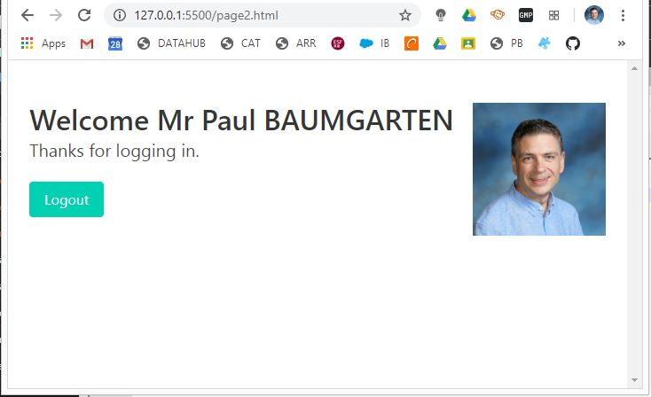

# javascript-firebase-demo

A simple demo of using Google Firebase with Javascript web app

Demo project contsists of just two pages:

* index.html that is the welcome page with the login button
* page2.html that contains our project functionality once logged in



To setup Firebase project and authentication...

* Log in to firebase.google.com
* Create project
* Register web app within the project
* Enable Google authentication
* Add 127.0.0.1 as an authorised domain
* Copy the firebase API keys into your HTML
* Copy the Firebase JS SDK script loads into your HTML (eg: firebase-auth.js

To setup Firebase database (Cloud Firestore)...

* Database / Create
* Start in production mode
* Set location (note: for my students, asia-east2 is HK)
* Open the rules tab... set a rule (see examples below)

# Firebase database rules

For more detail refer to the [Firebase rules documentation](), which is where these examples have come from.

Any user who is signed in can read and write any record.

```text
service cloud.firestore {
  match /databases/{database}/documents {
    match /{document=**} {
      allow read, write: if request.auth.uid != null;
    }
  }
}
```

These rules restrict access to the authenticated owner of the content only. The data is only readable and writable by one user, and the data path contains the user's ID.

```text
service cloud.firestore {
  match /databases/{database}/documents {
    // Allow only authenticated content owners access
    match /some_collection/{userId}/{documents=**} {
      allow read, write: if request.auth.uid == userId
    }
  }
}
```

This rule allows anyone (public) to read a data set, but restricts the ability to create or modify data at a given path to the authenticated content owner only.

```text
service cloud.firestore {
  match /databases/{database}/documents {
    // Allow public read access, but only content owners can write
    match /some_collection/{document} {
      allow read: if true
      allow create: if request.auth.uid == request.resource.data.author_uid;
      allow update, delete: if request.auth.uid == resource.data.author_uid;
    }
  }
}
```

This rule allows anyone signed in (authenticated) to read a data set, but restricts the ability to create or modify data at a given path to the authenticated content owner only.

```text
service cloud.firestore {
  match /databases/{database}/documents {
    // Allow public read access, but only content owners can write
    match /some_collection/{document} {
      allow read: if request.auth.uid == userId;
      allow create: if request.auth.uid == request.resource.data.author_uid;
      allow update, delete: if request.auth.uid == resource.data.author_uid;
    }
  }
}
```

